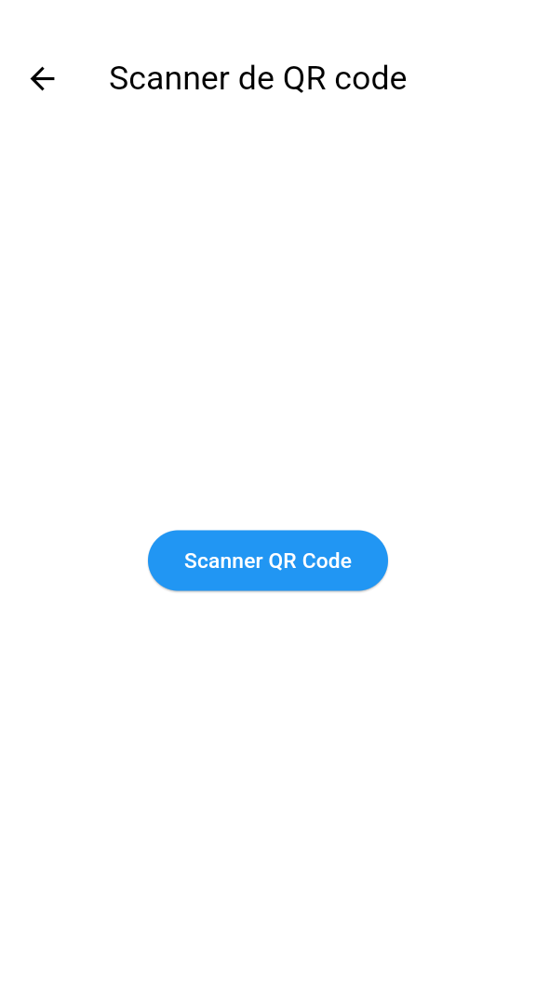

# EZQRContact

> The open source mobile app to swap professional contacts in person, no cloud, no account, no subscription.

[](LICENSE)
[](https://flutter.dev)
[](https://github.com/jojo8356/EZQRContact/stargazers)
[](https://github.com/jojo8356/EZQRContact/commits/main)

## Table of Contents

1. [What is EZQRContact?](#what-is-ezqrcontact)
2. [Why](#why)
3. [Features](#features)
4. [Screenshots](#screenshots)
5. [Stack](#stack)
6. [Install / Quickstart](#install--quickstart)
7. [Project structure](#project-structure)
8. [Contributing](#contributing)
9. [Roadmap](#roadmap)
10. [License](#license)

## What is EZQRContact?

EZQRContact is a Flutter mobile app (Android and iOS) that lets professionals
swap their contact info via personalized QR codes in one scan, without any
cloud, account, or subscription. Built for sales reps, exhibitors, recruiters,
and freelancers who exchange 5 to 200 contacts per day at trade shows,
conferences, networking events, and one-on-one meetings.

You generate a QR code that encodes your full vCard (name, phone, email,
photo, address, organization). Anyone scans it with their phone camera and
your contact lands directly in their address book. No third-party app
required on the recipient side.

## Why

100 billion paper business cards are produced each year worldwide, and 88%
are thrown away within a week. Digital alternatives like Blinq, HiHello, and
Popl work, but they all require a cloud account, lock you into a SaaS, and
cost 8 to 15 USD per month.

EZQRContact is different:

- **Open source MIT.** Fork it, audit it, modify it.
- **Local first.** Your data stays on your phone. No cloud transit, no
  third-party processor.
- **GDPR by absence.** No DPA needed when you use it at events with EU
  attendees.
- **Mobile native.** The only open source digital business card project that
  installs on the phone (others are web or PWA).
- **Free forever.** No Pro tier, no premium features behind a paywall.

## Features

- Generate QR encoded vCard 3.0 (universal compat, iOS + Android + Outlook +
  Google) or 4.0 (toggle in settings)
- Scan QR via camera or import a screenshot from gallery
- Add a profile photo (auto resized to 720x720 JPEG, embedded in vCard)
- Customize visual: primary color, logo center, layout templates
- Capture and preserve sender visual identity when scanning their QR (unique
  feature)
- Export captured contacts to PDF (1 per page or 2x2 compact)
- Group contacts by event (e.g. "Salon Tech Paris 2026")
- Sync any contact to your phone book (with replace, clone, or fill empty
  options)
- French and English UI
- Light and dark mode

## Screenshots

<!--  -->
<!--  -->
<!--  -->
<!--  -->

_Screenshots coming with the v2.0 release._

## Stack

### Core
- Flutter SDK `^3.8.1`, Dart 3.x
- Targets: Android 7.0+ (API 24), iOS 13+

### Persistence
- [`sqflite ^2.4.2`](https://pub.dev/packages/sqflite) (migration to Drift planned for v2)
- [`shared_preferences ^2.5.3`](https://pub.dev/packages/shared_preferences)
- [`path_provider ^2.1.5`](https://pub.dev/packages/path_provider)

### QR / Scan
- [`mobile_scanner ^6.0.2`](https://pub.dev/packages/mobile_scanner)
- [`qr_flutter ^4.0.0`](https://pub.dev/packages/qr_flutter)
- [`flutter_qrcode_analysis ^1.0.2`](https://pub.dev/packages/flutter_qrcode_analysis)
- [`ai_barcode_scanner ^6.0.1`](https://pub.dev/packages/ai_barcode_scanner)

### Contacts and permissions
- [`flutter_contacts ^1.1.9+2`](https://pub.dev/packages/flutter_contacts)
- [`permission_handler ^12.0.1`](https://pub.dev/packages/permission_handler)

### UI
- [`provider ^6.1.5+1`](https://pub.dev/packages/provider) (singleton style usage)
- [`toastification ^3.0.3`](https://pub.dev/packages/toastification)
- [`flutter_markdown ^0.7.7+1`](https://pub.dev/packages/flutter_markdown)
- [`font_awesome_flutter ^10.10.0`](https://pub.dev/packages/font_awesome_flutter)

### Files and images
- [`image ^4.5.4`](https://pub.dev/packages/image)
- [`file_saver ^0.3.1`](https://pub.dev/packages/file_saver)
- [`file_picker ^10.3.2`](https://pub.dev/packages/file_picker)
- [`image_picker ^1.2.0`](https://pub.dev/packages/image_picker)

### Dev tools
- `flutter_lints ^5.0.0` (migration to `very_good_analysis` planned for v2)
- `flutter_native_splash ^2.4.6`
- `flutter_launcher_icons ^0.14.4`

## Install / Quickstart

**Requirements**

- Flutter SDK `^3.8.1` ([install guide](https://docs.flutter.dev/get-started/install))
- Android SDK with `compileSdkVersion = 35` (constraint of `permission_handler 12`)
- Xcode 15+ for iOS builds

**Run in dev mode**

```bash
git clone https://github.com/jojo8356/EZQRContact.git
cd EZQRContact
flutter pub get
flutter run
```

**Build a release**

The repo ships with helper scripts at the root:

- `build.sh` for development builds
- `prod.sh` for production releases

Read each script before invoking it. iOS release requires a Mac with a valid
Apple Developer account.

## Project structure

```
lib/
  main.dart        # Entry + MaterialApp + routes
  pages/           # Top level screens
  components/      # Reusable widgets
  modals/          # Modal dialogs
  providers/       # Singleton state (theme, lang, dark mode)
  tools/           # Helpers (vcard, contacts, db)
```

The full v2.0 architecture, ADRs, and migration plan are documented in
[`_bmad-output/planning-artifacts/architecture-ezqrcontact-v2-2026-05-06.md`](_bmad-output/planning-artifacts/architecture-ezqrcontact-v2-2026-05-06.md).

## Contributing

Contributions are welcome. A full `CONTRIBUTING.md` with setup, conventions,
and PR workflow is coming with the v2.0 release.

For now, you can:

- Open issues with bugs, ideas, or questions
- Star the repo if you find it useful
- Fork and propose features via PR

Issues tagged `good first issue` are intentionally easy entry points for
first time contributors.

## Roadmap

The v2.0 roadmap is broken into 9 epics and 33 stories, organized in 8
sprints. See [the full epics document](_bmad-output/planning-artifacts/epics-and-stories-ezqrcontact-v2-2026-05-06.md).

Highlights:

- **E0**: Open source preparation (LICENSE, README, CONTRIBUTING, screenshots)
- **E1**: Foundation (Drift ORM migration, lints, CI)
- **E2**: vCard 3.0 refactor (universal compat fix)
- **E3**: Visual customization (colors, logo, photo)
- **E4**: Scan and contacts management
- **E5**: Blue ocean differentiators (visual config preserved, reciprocal swap)
- **E6**: PDF export and event tagging
- **E7**: Onboarding and accessibility
- **E8**: CI/CD and release pipeline

## License

This project is licensed under the MIT License. See the [LICENSE](LICENSE) file for details.
